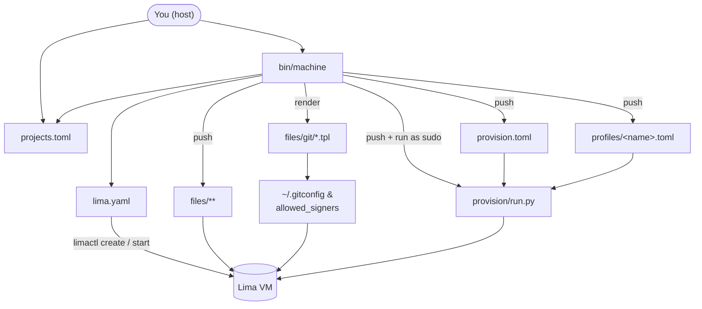

# machine — one isolated Lima VM per project

[runmachine.dev](https://runmachine.dev/)


A reproducible Lima VM per GitHub project, with Docker, Node, agent CLIs (Claude Code, Codex), GitHub CLI (`gh`), signed git, and tool profiles (e.g. Cypress, Supabase + flyctl) you opt into per project. Each project lives in its own VM so they can't see each other and the host filesystem isn't mounted.

Claude Code comes pre-installed with the official marketplace and these plugins enabled: `frontend-design`, `superpowers`, `github`, `typescript-lsp`, `security-guidance`, `commit-commands`, `chrome-devtools-mcp`, `supabase`. Permission `defaultMode` is set to `auto`.

## Install

```sh
brew install katspaugh/machine/machine
```

The formula pulls in `lima` and `python@3.12`. The tap repo is [katspaugh/homebrew-machine](https://github.com/katspaugh/homebrew-machine); each release is pinned to a tagged tarball + SHA256. See [docs/TAP.md](docs/TAP.md) for the release runbook.

Prefer to run from a clone (dev mode)? Skip the brew install and:

```sh
git clone git@github.com:katspaugh/machine.git ~/Sites/machine
~/Sites/machine/bin/machine doctor
```

In dev mode `projects.toml` lives at the repo root; under brew it lives at `~/.config/machine/projects.toml` (override with `MACHINE_CONFIG_DIR`).

## Prerequisites

- An SSH key on the host, served by an agent the VM can forward. Either:
  - **macOS Keychain** (default): `ssh-add --apple-use-keychain ~/.ssh/id_ed25519`
  - **1Password**: enable 1Password → Settings → Developer → *Use the SSH agent*, then run `machine` with `MACHINE_USE_1PASSWORD=1` (see [SSH agent](#ssh-agent) below).
- That key registered as a **signing key** on GitHub (Settings → SSH and GPG keys → New SSH key → Key type: Signing).
- Host `git config --global user.name` and `user.email` set (or override via `GIT_NAME` / `GIT_EMAIL`).

Run `machine doctor` to verify everything resolves.

## Setup

```sh
machine init                  # writes ~/.config/machine/projects.toml from the bundled example
$EDITOR ~/.config/machine/projects.toml
```

(In dev mode: `cp projects.toml.example projects.toml && $EDITOR projects.toml` from the repo root.)

Example `projects.toml`:

```toml
default_profile = "cypress"           # applied when a project omits `profiles`

[blog]
repos = ["git@github.com:you/blog.git"]

# Multi-repo: sibling-clones in one VM. The first is the "primary" —
# `machine ssh wallet` opens at its directory.
[wallet]
profiles = ["cypress"]
repos = [
  "git@github.com:you/safe-wallet-dev-env.git",
  "git@github.com:you/safe-wallet-monorepo.git",
  "git@github.com:you/safe-client-gateway.git",
]

# Multiple profiles stack.
[playground]
profiles = ["cypress", "supabase-fly"]
repos = ["git@github.com:you/playground.git"]
```

## Quickstart

```sh
machine up blog            # creates + starts + provisions VM "blog", clones the repo
machine ssh blog           # interactive shell, cwd = ~/code/blog
```


Provisioning output is captured to `~/.local/state/machine/logs/<vm>-<iso>.log` (or `<repo>/.build/logs/` in a git checkout) — the path is printed at the start of every `up` run. Pass `--verbose` to stream raw output inline.

Inside the VM, each repo is at `~/code/<repo-basename>/`. JS deps are installed automatically on first clone (yarn / pnpm / npm, picked from `packageManager` in `package.json`). For env vars, drop a `.env` file in the project — Node's `dotenv` (or your framework) reads it directly. For secrets you'd rather not write to disk, see [1Password env injection](#1password-env-injection).

Host browser → VM web app: ports `3000-3010`, `4200`, `5173-5180`, `8080-8099` are forwarded to `127.0.0.1`.

## New tabs inside the VM

`machine ssh <project>` attaches to a per-project tmux session (created on first connect, named after the project, starting at `~/code/<primary-repo>`). New "tabs" need to be created from inside the VM rather than via the host terminal's Cmd+T, because the host shortcut opens a tab on the **host** at the host's cwd — not in the VM.

Inside the session:

| Keys | What |
|---|---|
| `Ctrl-b c` | New window ("tab") — starts in the current pane's VM cwd |
| `Ctrl-b n` / `p` | Next / previous window |
| `Ctrl-b "` / `%` | Horizontal / vertical split — also inherits the pane cwd |
| `Ctrl-b d` | Detach (session keeps running; reattach with `machine ssh <project>`) |

The session survives detach, so closing the host terminal and reconnecting later drops you back into the same windows. To get a plain non-tmux shell instead, use `machine run <project> bash -l` or `limactl shell <project>` directly.

## IDE integration (VS Code, Cursor, JetBrains Gateway)

`machine up <project>` (and `rebuild`/`destroy`) maintains a sentinel-delimited block in `~/.ssh/config`, so any IDE that reads SSH config sees the VM directly:

```
Host machine-<project>
    HostName 127.0.0.1
    Port <lima-port>
    User <vm-user>
    IdentityFile <lima-key>
    IdentitiesOnly yes
    StrictHostKeyChecking no
    UserKnownHostsFile /dev/null
    ForwardAgent yes
```

In VS Code → Remote-SSH: open the host picker, pick `machine-<project>`, then open `/home/<vm-user>/code/<repo>`. Same flow in Cursor and JetBrains Gateway. `ForwardAgent yes` means commit signing and `gh` work in the IDE's integrated terminal just like in `machine ssh`.

`machine doctor` reports drift — missing block, stale ports, orphan entries, loose permissions. The block is rewritten end-to-end on every `up`/`rebuild`/`destroy`, so running `machine up <any-project>` is the recovery path if it ever goes out of sync.

## Commands

| Command | What |
|---|---|
| `machine list` | List projects from `projects.toml`. `--json` for machine-readable output. |
| `machine ps` | Rich live-status table: per-VM uptime, CPU/mem, repo + branch, idle time, active host ports. `--json` for machine-readable output. |
| `machine doctor` | Preflight host checks: lima, git config, SSH agent, signing key, `op` CLI. `--json` for machine-readable output. |
| `machine validate` | Schema-check `projects.toml` and referenced profiles (no VM) |
| `machine up <p>` | Create if needed, start, provision, clone the repo(s). Idempotent. `--dry-run` prints provision steps without executing. `--verbose` streams raw provisioner output; `--plain` disables the spinner (useful in CI). |
| `machine down <p>` | Stop the VM |
| `machine ssh <p>` | Interactive shell (cwd = `~/code/<primary-repo>`). Attaches to a per‑project tmux session so `Ctrl‑b c` opens new windows that stay in the VM at the current pane's cwd. |
| `machine claude <p>` | Open an SSH session and launch `claude` straight away (cwd = `~/code/<primary-repo>`). Exiting `claude` ends the session. |
| `machine run <p> <cmd>...` | Non-interactive command in the VM |
| `machine secrets <p> [<repo>]` | Render 1Password Environment(s) into VM tmpfs ([1Password env injection](#1password-env-injection)) |
| `machine secrets --clear <p> [<repo>]` | Wipe rendered secrets from VM tmpfs |
| `machine status <p>` | `limactl list` for the VM |
| `machine update <p>` | Refresh in-place: `apt upgrade`, npm globals, claude installer. `--reprovision` also re-applies TOML configs. |
| `machine rebuild <p>` | **Destroys** the VM and rebuilds from scratch (reproducibility test). `-y` skips confirmation. |
| `machine destroy <p>` | Delete the VM. `-y` skips confirmation. |
| `machine config add-project <name> --repo <url> [--profile ...]` | Append a project to `projects.toml` (used by the GUI; refuses to overwrite). |

## Repository layout

```
machine/
├── bin/machine             # host CLI: drives Lima, pushes config into the VM
├── provision/run.py        # in-VM dispatcher: reads merged TOMLs, runs steps
├── provision.toml          # base provisioning config (always applied)
├── profiles/*.toml         # opt-in profile add-ons (cypress, python, rust, go, supabase-fly)
├── projects.toml.example   # template for your projects.toml (the real one is gitignored)
├── lima.yaml               # Lima VM template (CPU/mem/disk, port-forwards, no host mounts)
├── files/                  # files copied verbatim into each VM
│   ├── zsh/                #   ~/.zshrc
│   ├── fish/               #   ~/.config/fish/config.fish
│   ├── profile.d/          #   /etc/profile.d snippets (PATH, direnv, corepack)
│   ├── direnv/             #   `use op_env` helper for 1Password env injection
│   ├── git/                #   gitconfig + allowed_signers templates (host-rendered)
│   └── ssh/                #   pre-seeded known_hosts
├── schemas/                # JSON Schemas for projects.toml + provision.toml (used by `validate`)
├── completions/            # bash/zsh/fish completions for the `machine` CLI
├── tests/                  # tests/lint.sh, tests/unit.sh (host); tests/smoke-*.sh (in-VM)
├── assets/                 # README gif/banner + VHS recording script (not deployed)
└── .github/workflows/      # CI: lint, unit, validate, dry-run provision
```



Everything under `files/` is data that lands inside the VM. Everything under `bin/`, `provision/`, `tests/`, `schemas/`, `completions/`, plus the top-level TOMLs and `lima.yaml`, is code or configuration that runs on the host or is read by `provision/run.py`. `assets/` contains README media and the demo recorder; nothing under `assets/` is ever pushed to a VM.

What happens on `bin/machine up <p>`:

- If the VM doesn't exist, `limactl create --name=<p>` against `lima.yaml`, then `limactl start <p>`.
- Push `provision.toml`, the project's `profiles/<name>.toml` files, `provision/run.py`, and the `files/` tree into `/opt/dev-vm/` on the VM.
- Render `files/git/*.tpl` on the host (substituting your name, email, and SSH signing pubkey), and push the results to the same location.
- Run `sudo python3 /opt/dev-vm/provision/run.py provision.toml <profiles...>` inside the VM.
- Clone the listed `repos` into `~/code/<basename>/` in parallel.

GitHub auth and commit signing both use the forwarded SSH agent — private keys never leave the host; the VM only sees signatures and `ssh -A` proxied auth.

## Provisioning

The provisioning system is declarative: tools are listed in TOML files, and a small Python dispatcher applies them.

- **`provision.toml`** — the base config, always applied. Lists apt packages, third-party apt repos (Docker, GitHub CLI, NodeSource for Node), `curl|bash` installers (Claude Code), npm globals (Codex, TypeScript), `/etc/profile.d` snippets, Claude marketplace + plugins.
- **`profiles/<name>.toml`** — optional add-ons. Ship with `machine`:
  - `cypress.toml` — Cypress runtime libs + Chrome (amd64) or chromium (arm64).
  - `supabase-fly.toml` — Supabase CLI (release tarball) + flyctl (`curl|bash`).
  - `python.toml` — `uv` (package + project manager) + `ruff` + `pyright`.
  - `rust.toml` — `rustup` with the stable toolchain (minimal profile).
  - `go.toml` — pinned Go from go.dev (edit the version in the file to bump).
- **`provision/run.py`** — reads the base + selected profiles, merges, and runs them in fixed step order. Idempotent via sentinels under `/var/lib/dev-vm/provisioned/`.

Adding a tool that fits a typed section (apt package, npm global, apt repo, `curl|bash` installer, GitHub release tarball, Claude plugin) is one line in TOML. The `[[shell]]` section is an escape hatch for genuinely-shell-shaped one-offs (writing config files, `chsh`, etc.).

Schema reference is in the comments at the top of `provision.toml`.

## Verifying

```sh
bash tests/run-all.sh <project>     # full VM smokes (lint + boot + docker + node + git-sign + …)
bash tests/unit.sh                  # host-side Python unit tests (no VM)
machine validate                    # schema-check the TOMLs
machine doctor                      # preflight host environment
```

`tests/run-all.sh` requires a provisioned VM (set `MACHINE_NAME=<project>` or pass the project as arg 1). `tests/unit.sh` runs offline.

## Shell completion

Bash, zsh, and fish completions ship under `completions/`:

```sh
# bash
echo 'source /path/to/machine/completions/machine.bash' >> ~/.bashrc

# zsh (somewhere in $fpath)
ln -s "$PWD/completions/_machine" /usr/local/share/zsh/site-functions/_machine

# fish
ln -s "$PWD/completions/machine.fish" ~/.config/fish/completions/machine.fish
```

## SSH agent

By default the VM forwards whatever the host's `SSH_AUTH_SOCK` points at — on macOS that's launchd's agent, which serves keys you loaded with `ssh-add --apple-use-keychain` (passphrase cached in Keychain).

To use 1Password's agent instead — keys never touch `~/.ssh`, every signature prompts for Touch ID:

```sh
brew install 1password-cli                    # only needed for OP_SIGNING_KEY_REF
# In 1Password: Settings → Developer → "Use the SSH agent"
export MACHINE_USE_1PASSWORD=1                # for the current shell, or your shell rc
machine up <project>
```

For the git signing pubkey, the resolution order is:

1. `GIT_SIGNING_KEY=<literal pubkey string>`
2. `OP_SIGNING_KEY_REF=op://Vault/Item/public_key` — fetched via `op read` (requires `op` CLI; triggers Touch ID once at `up` time)
3. `GIT_SIGNING_PUBKEY_FILE=<path>`
4. Host `git config --global user.signingkey` — literal pubkey or path to a `.pub` file (default; whatever you sign host commits with)

## 1Password env injection

For project secrets you don't want to write to disk, drop a `.envrc` in the repo referencing a 1Password [Environment](https://developer.1password.com/docs/cli/environments/) ID:

```sh
echo 'use op_env <environment-id>' > .envrc
direnv allow
```

Then on the host:

```sh
machine secrets <project>               # syncs every .envrc using `use op_env` in that VM
machine secrets <project> <repo>        # narrow to one repo within a multi-repo project
```

`machine secrets` reads the Environment from 1Password (Touch ID), pipes the rendered KEY=value pairs into the VM, and writes them to `$XDG_RUNTIME_DIR/dev-secrets/<env-id>.env` (tmpfs, mode 600, gone on reboot). The `op_env` direnv helper loads that cache when you `cd` into the project. No host-side disk path is involved.

Create an Environment in 1Password desktop: Developer → Environments → New. Copy its ID via Manage environment → Copy ID.

## Threat model

No host filesystem is mounted. Each project gets its own VM, so a compromise of one project can't reach another's code or env. The host exposes two narrow channels: the forwarded SSH agent (auth + signing — private keys stay on the host, the VM can only request signatures while it's running), and `machine secrets` pushing rendered 1Password Environments into tmpfs (no disk persistence). A fully compromised VM cannot read the 1Password vault — only the secrets a repo explicitly rendered, and only while that tmpfs lives.

## Override knobs

| Env var | Default |
|---|---|
| `GIT_NAME` / `GIT_EMAIL` | from host `git config --global` |
| `GIT_SIGNING_PUBKEY_FILE` | path to a `.pub` file (overrides host `user.signingkey`) |
| `GIT_SIGNING_KEY` | literal pubkey string (overrides everything) |
| `OP_SIGNING_KEY_REF` | 1Password secret reference for the signing pubkey (e.g. `op://Personal/SSH/public key`) |
| `MACHINE_USE_1PASSWORD` | set `=1` to forward 1Password's SSH agent instead of macOS Keychain |
| `ONEPASS_SOCK` | `~/Library/Group Containers/2BUA8C4S2C.com.1password/t/agent.sock` |
| `PROJECTS_FILE` | `<repo>/projects.toml` |
| `MACHINE_VERBOSE` | set `=1` to stream raw provisioner output inline (equivalent to `--verbose`) |
| `MACHINE_PLAIN` | set `=1` to disable the spinner and use plain text output (equivalent to `--plain`) |
| `MACHINE_PROVISION_LOG` | override the default provisioning log path (`<state-dir>/logs/<vm>-<iso>.log`) |
