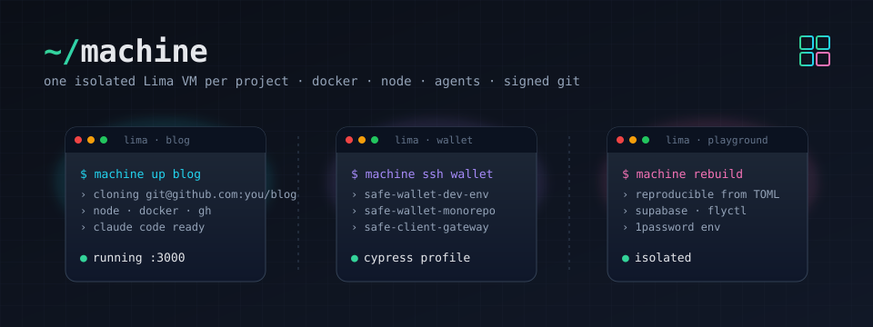

# machine — one isolated Lima VM per project



A reproducible Lima VM per GitHub project, with Docker, Node, agent CLIs (Claude Code, Codex), GitHub CLI (`gh`), signed git, and tool profiles (e.g. Cypress, Supabase + flyctl) you opt into per project. Each project lives in its own VM so they can't see each other and the host filesystem isn't mounted.

Claude Code comes pre-installed with the official marketplace and these plugins enabled: `frontend-design`, `superpowers`, `github`, `typescript-lsp`, `security-guidance`, `commit-commands`, `chrome-devtools-mcp`, `supabase`. Permission `defaultMode` is set to `auto`.

## Prerequisites

```sh
brew install lima
```

`bin/machine` uses `python3` with `tomllib` (Python 3.11+). macOS 14+ ships 3.12 system Python; otherwise `brew install python@3.12`. Run `bin/machine doctor` after the first clone to verify everything resolves.

- An SSH key on the host, served by an agent the VM can forward. Either:
  - **macOS Keychain** (default): `ssh-add --apple-use-keychain ~/.ssh/id_ed25519`
  - **1Password**: enable 1Password → Settings → Developer → *Use the SSH agent*, then run `machine` with `MACHINE_USE_1PASSWORD=1` (see [SSH agent](#ssh-agent) below).
- That key registered as a **signing key** on GitHub (Settings → SSH and GPG keys → New SSH key → Key type: Signing).
- Host `git config --global user.name` and `user.email` set (or override via `GIT_NAME` / `GIT_EMAIL`).

## Setup

```sh
git clone git@github.com:katspaugh/machine.git ~/Sites/machine
cd ~/Sites/machine
cp projects.toml.example projects.toml
$EDITOR projects.toml
```

Example `projects.toml`:

```toml
default_profile = "cypress"           # applied when a project omits `profiles`

[blog]
repos = ["git@github.com:you/blog.git"]

# Multi-repo: sibling-clones in one VM. The first is the "primary" —
# `machine ssh wallet` opens at its directory.
[wallet]
profiles = ["cypress"]
repos = [
  "git@github.com:you/safe-wallet-dev-env.git",
  "git@github.com:you/safe-wallet-monorepo.git",
  "git@github.com:you/safe-client-gateway.git",
]

# Multiple profiles stack.
[playground]
profiles = ["cypress", "supabase-fly"]
repos = ["git@github.com:you/playground.git"]
```

## Quickstart

```sh
bin/machine up blog        # creates + starts + provisions VM "blog", clones the repo
bin/machine ssh blog       # interactive shell, cwd = ~/code/blog
```


Inside the VM, each repo is at `~/code/<repo-basename>/`. JS deps are installed automatically on first clone (yarn / pnpm / npm, picked from `packageManager` in `package.json`). For env vars, drop a `.env` file in the project — Node's `dotenv` (or your framework) reads it directly. For secrets you'd rather not write to disk, see [1Password env injection](#1password-env-injection).

Host browser → VM web app: ports `3000-3010`, `4200`, `5173-5180`, `8080-8099` are forwarded to `127.0.0.1`.

## Commands

| Command | What |
|---|---|
| `bin/machine list` | List projects from `projects.toml` |
| `bin/machine ps` | List projects with live VM status |
| `bin/machine doctor` | Preflight host checks: lima, git config, SSH agent, signing key, `op` CLI |
| `bin/machine validate` | Schema-check `projects.toml` and referenced profiles (no VM) |
| `bin/machine up <p>` | Create if needed, start, provision (base + project's profiles), clone the repo(s). Idempotent. `--dry-run` prints provision steps without executing. |
| `bin/machine down <p>` | Stop the VM |
| `bin/machine ssh <p>` | Interactive shell (cwd = `~/code/<primary-repo>`) |
| `bin/machine run <p> <cmd>...` | Non-interactive command in the VM |
| `bin/machine secrets <p> [<repo>]` | Render 1Password Environment(s) into VM tmpfs ([1Password env injection](#1password-env-injection)) |
| `bin/machine secrets --clear <p> [<repo>]` | Wipe rendered secrets from VM tmpfs |
| `bin/machine status <p>` | `limactl list` for the VM |
| `bin/machine update <p>` | Refresh in-place: `apt upgrade`, npm globals, claude installer. `--reprovision` also re-applies TOML configs. |
| `bin/machine rebuild <p>` | **Destroys** the VM and rebuilds from scratch (reproducibility test). `-y` skips confirmation. |
| `bin/machine destroy <p>` | Delete the VM. `-y` skips confirmation. |

## Provisioning

The provisioning system is declarative: tools are listed in TOML files, and a small Python dispatcher applies them.

- **`provision.toml`** — the base config, always applied. Lists apt packages, third-party apt repos (Docker, GitHub CLI, NodeSource for Node), `curl|bash` installers (Claude Code), npm globals (Codex, TypeScript), `/etc/profile.d` snippets, Claude marketplace + plugins.
- **`profiles/<name>.toml`** — optional add-ons. Ship with `machine`:
  - `cypress.toml` — Cypress runtime libs + Chrome (amd64) or chromium (arm64).
  - `supabase-fly.toml` — Supabase CLI (release tarball) + flyctl (`curl|bash`).
  - `python.toml` — `uv` (package + project manager) + `ruff` + `pyright`.
  - `rust.toml` — `rustup` with the stable toolchain (minimal profile).
  - `go.toml` — pinned Go from go.dev (edit the version in the file to bump).
- **`provision/run.py`** — reads the base + selected profiles, merges, and runs them in fixed step order. Idempotent via sentinels under `/var/lib/dev-vm/provisioned/`.

Adding a tool that fits a typed section (apt package, npm global, apt repo, `curl|bash` installer, GitHub release tarball, Claude plugin) is one line in TOML. The `[[shell]]` section is an escape hatch for genuinely-shell-shaped one-offs (writing config files, `chsh`, etc.).

Schema reference is in the comments at the top of `provision.toml`.

## Verifying

```sh
bash tests/run-all.sh <project>     # full VM smokes (lint + boot + docker + node + git-sign + …)
bash tests/unit.sh                  # host-side Python unit tests (no VM)
bin/machine validate                # schema-check the TOMLs
bin/machine doctor                  # preflight host environment
```

`tests/run-all.sh` requires a provisioned VM (set `MACHINE_NAME=<project>` or pass the project as arg 1). `tests/unit.sh` runs offline.

## Shell completion

Bash, zsh, and fish completions ship under `completions/`:

```sh
# bash
echo 'source /path/to/machine/completions/machine.bash' >> ~/.bashrc

# zsh (somewhere in $fpath)
ln -s "$PWD/completions/_machine" /usr/local/share/zsh/site-functions/_machine

# fish
ln -s "$PWD/completions/machine.fish" ~/.config/fish/completions/machine.fish
```

## How it works

- `lima.yaml` is the per-VM template. `bin/machine up <p>` runs `limactl create --name=<p> lima.yaml` if the VM doesn't exist, then `limactl start <p>`, then pushes `provision.toml`, the project's profile TOMLs, `provision/run.py`, and the `files/` tree into `/opt/dev-vm/` and runs `sudo python3 /opt/dev-vm/provision/run.py provision.toml <profiles...>`.
- Git config is rendered on the host from `files/git/*.tpl`, substituting your name/email and SSH signing pubkey, then pushed to the VM.
- GitHub auth + commit signing both use the forwarded SSH agent. Private keys never leave the host; the VM only sees signatures and `ssh -A` proxied auth.

## SSH agent

By default the VM forwards whatever the host's `SSH_AUTH_SOCK` points at — on macOS that's launchd's agent, which serves keys you loaded with `ssh-add --apple-use-keychain` (passphrase cached in Keychain).

To use 1Password's agent instead — keys never touch `~/.ssh`, every signature prompts for Touch ID:

```sh
brew install 1password-cli                    # only needed for OP_SIGNING_KEY_REF
# In 1Password: Settings → Developer → "Use the SSH agent"
export MACHINE_USE_1PASSWORD=1                # for the current shell, or your shell rc
bin/machine up <project>
```

For the git signing pubkey, the resolution order is:

1. `GIT_SIGNING_KEY=<literal pubkey string>`
2. `OP_SIGNING_KEY_REF=op://Vault/Item/public_key` — fetched via `op read` (requires `op` CLI; triggers Touch ID once at `up` time)
3. `GIT_SIGNING_PUBKEY_FILE=<path>`
4. Host `git config --global user.signingkey` — literal pubkey or path to a `.pub` file (default; whatever you sign host commits with)

## 1Password env injection

For project secrets you don't want to write to disk, drop a `.envrc` in the repo referencing a 1Password [Environment](https://developer.1password.com/docs/cli/environments/) ID:

```sh
echo 'use op_env <environment-id>' > .envrc
direnv allow
```

Then on the host:

```sh
bin/machine secrets <project>           # syncs every .envrc using `use op_env` in that VM
bin/machine secrets <project> <repo>    # narrow to one repo within a multi-repo project
```

`machine secrets` reads the Environment from 1Password (Touch ID), pipes the rendered KEY=value pairs into the VM, and writes them to `$XDG_RUNTIME_DIR/dev-secrets/<env-id>.env` (tmpfs, mode 600, gone on reboot). The `op_env` direnv helper loads that cache when you `cd` into the project. No host-side disk path is involved.

Create an Environment in 1Password desktop: Developer → Environments → New. Copy its ID via Manage environment → Copy ID.

## Threat model

No host filesystem is mounted. Each project gets its own VM, so a compromise of one project can't reach another's code or env. The host exposes two narrow channels: the forwarded SSH agent (auth + signing — private keys stay on the host, the VM can only request signatures while it's running), and `machine secrets` pushing rendered 1Password Environments into tmpfs (no disk persistence). A fully compromised VM cannot read the 1Password vault — only the secrets a repo explicitly rendered, and only while that tmpfs lives.

## Override knobs

| Env var | Default |
|---|---|
| `GIT_NAME` / `GIT_EMAIL` | from host `git config --global` |
| `GIT_SIGNING_PUBKEY_FILE` | path to a `.pub` file (overrides host `user.signingkey`) |
| `GIT_SIGNING_KEY` | literal pubkey string (overrides everything) |
| `OP_SIGNING_KEY_REF` | 1Password secret reference for the signing pubkey (e.g. `op://Personal/SSH/public key`) |
| `MACHINE_USE_1PASSWORD` | set `=1` to forward 1Password's SSH agent instead of macOS Keychain |
| `ONEPASS_SOCK` | `~/Library/Group Containers/2BUA8C4S2C.com.1password/t/agent.sock` |
| `PROJECTS_FILE` | `<repo>/projects.toml` |
