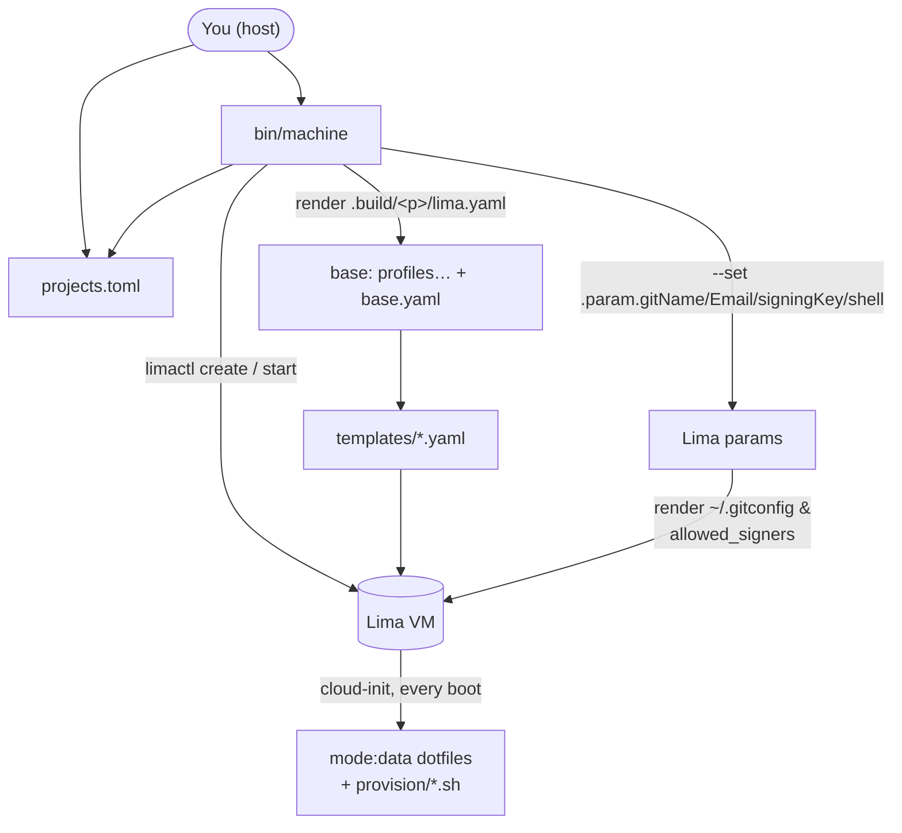

# machine — one isolated Lima VM per project

[](https://github.com/katspaugh/machine/actions/workflows/ci.yml)
[](https://github.com/katspaugh/machine/actions/workflows/smoke.yml)

[runmachine.dev](https://runmachine.dev/)


A reproducible Lima VM per GitHub project, with Docker, Node, agent CLIs (Claude Code, Codex), GitHub CLI (`gh`), signed git, and tool profiles (e.g. Cypress, Playwright, Supabase + flyctl, modern CLI tools) you opt into per project. Each project lives in its own VM so they can't see each other and the host filesystem isn't mounted.

Claude Code comes pre-installed with the official marketplace and these plugins enabled: `frontend-design`, `superpowers`, `github`, `typescript-lsp`, `security-guidance`, `commit-commands`, `chrome-devtools-mcp`, `supabase`. Permission `defaultMode` is set to `auto`.

## Why

AI coding agents are most useful with full autonomy — and full autonomy on
your host means access to your keys, your other projects, and everything
`npm install` drags in. `machine` gives each project a disposable VM where
"yes to everything" is a safe answer: no host filesystem mount, keys stay on
the host behind a forwarded agent, secrets live in tmpfs.
Read the guide: [Sandboxing Claude Code](https://runmachine.dev/sandboxing-claude-code/).

## Install

```sh
brew install katspaugh/machine/machine
```

The formula pulls in `lima` (**2.0 or newer is required** — template composition and `mode: data` provisioning don't exist in 1.x) and `python@3.12`. The tap repo is [katspaugh/homebrew-machine](https://github.com/katspaugh/homebrew-machine); each release is pinned to a tagged tarball + SHA256. See [docs/TAP.md](docs/TAP.md) for the release runbook.

Prefer to run from a clone (dev mode)? Skip the brew install and:

```sh
git clone git@github.com:katspaugh/machine.git ~/Sites/machine
~/Sites/machine/bin/machine doctor
```

In dev mode `projects.toml` lives at the repo root; under brew it lives at `~/.config/machine/projects.toml` (override with `MACHINE_CONFIG_DIR`).

### Nix

The repo is also a flake — no Homebrew needed:

```sh
nix profile install github:katspaugh/machine   # install
nix run github:katspaugh/machine -- doctor     # or run one-off
```

The flake pins its own Lima (≥ 2.0) and Python from nixpkgs-unstable. Pin a release with `github:katspaugh/machine/v0.2.0`.

## Prerequisites

- An SSH key on the host, served by an agent the VM can forward. Either:
  - **macOS Keychain** (default): `ssh-add --apple-use-keychain ~/.ssh/id_ed25519`
  - **1Password**: enable 1Password → Settings → Developer → *Use the SSH agent* — `machine` detects the agent socket and forwards it automatically (see [SSH agent](#ssh-agent) below).
- That key registered as a **signing key** on GitHub (Settings → SSH and GPG keys → New SSH key → Key type: Signing).
- Host `git config --global user.name` and `user.email` set (or override via `GIT_NAME` / `GIT_EMAIL`).

Run `machine doctor` to verify everything resolves.

## Setup

No setup needed for a scratch VM — `machine up` launches a base VM named
`default` out of the box (and `machine up <name>` offers to create an empty
VM under any name). Add a config when you want repos cloned or profiles:

```sh
machine init                  # writes ~/.config/machine/projects.toml from the bundled example
$EDITOR ~/.config/machine/projects.toml
```

(In dev mode: `cp projects.toml.example projects.toml && $EDITOR projects.toml` from the repo root.)

Example `projects.toml`:

```toml
# Projects without `profiles` get the base VM only. To opt every project
# into a profile by default: default_profile = "cypress"

[blog]
repos = ["git@github.com:you/blog.git"]

# Multi-repo: sibling-clones in one VM. The first is the "primary" —
# `machine ssh wallet` opens at its directory.
[wallet]
profiles = ["cypress"]
repos = [
  "git@github.com:you/safe-wallet-dev-env.git",
  "git@github.com:you/safe-wallet-monorepo.git",
  "git@github.com:you/safe-client-gateway.git",
]

# Multiple profiles stack.
[playground]
profiles = ["cypress", "supabase-fly"]
repos = ["git@github.com:you/playground.git"]
```

## How it works

`machine up <project>` generates a tiny Lima template in `.build/<project>/lima.yaml`:

```yaml
base:
- <repo>/templates/cypress.yaml     # one entry per profile (reversed)
- <repo>/templates/base.yaml        # the whole base VM, declaratively — listed
                                    # last so its provisioning runs first
```

Lima merges the stack (`base:` composition), boots the VM, and runs the
provisioning declared in the templates: `provision/*.sh` scripts and
`mode: data` dotfiles, applied by cloud-init on **every boot** — so
re-provisioning is just `machine down && machine up`. Your git identity and
signing key flow in as Lima params (`--set`) at create time and render into
`~/.gitconfig` inside the VM. Ports: Lima auto-forwards any listening guest
port to `127.0.0.1` on the host.

To update the toolchain in place: `machine down <p> && machine up <p>`
(provision scripts re-run; apt picks up new versions). To start truly fresh:
`machine destroy <p> && machine up <p>`. Changing your git identity or
signing key requires a recreate (params are fixed when the VM is created).

### SSH config

Lima writes a per-VM SSH config at `~/.lima/<project>/ssh.config`. Add one line to `~/.ssh/config`:

```
Include ~/.lima/*/ssh.config
```

Then `ssh lima-<project>` works everywhere.

## Quickstart

```sh
machine up                 # zero-config: creates + starts a base VM named "default"
machine up blog            # creates + starts + provisions VM "blog", clones the repo
machine ssh blog           # interactive shell, cwd = ~/code/blog
```


The first `up` bakes a provisioned base disk into `~/.cache/machine` (one-time per
template/provision change); subsequent boots reuse it. `limactl start` blocks
until provisioning finishes — on failure it points you at
`limactl shell <vm> sudo tail -100 /var/log/cloud-init-output.log`.

Inside the VM, each repo is at `~/code/<repo-basename>/`. JS deps are installed automatically on first clone (yarn / pnpm / npm, picked from `packageManager` in `package.json`). For env vars, drop a `.env` file in the project — Node's `dotenv` (or your framework) reads it directly. For secrets you'd rather not write to disk, see [1Password env injection](#1password-env-injection).

Host browser → VM web app: Lima auto-forwards any listening guest port to `127.0.0.1` on the host.

## IDE integration (VS Code, Cursor, JetBrains Gateway)

With the `Include` line from [SSH config](#ssh-config) in place, any IDE that reads
SSH config sees every VM. The host alias for a project is `lima-<project>`. In VS
Code → Remote-SSH: open the host picker, pick `lima-<project>`, then open
`/home/<vm-user>.linux/code/<repo>`. Same
flow in Cursor and JetBrains Gateway. Lima's config sets `ForwardAgent yes`, so commit
signing and `gh` work in the IDE's integrated terminal just like in `machine ssh`.

Because Lima owns the config file, it stays correct across `up`/`down`/`destroy`
automatically — there is no host `~/.ssh/config` block for `machine` to manage.

## Commands

| Command | What |
|---|---|
| `machine up [p]` | Create if needed, start, provision, clone the repo(s). Idempotent — re-running re-applies the provision scripts. No name → base VM `default`; unknown names offer an ad-hoc base VM. |
| `machine down <p>` | Stop the VM (preserves disk). Re-provision in place with `machine up <p>` afterwards. |
| `machine ssh <p>` | Interactive shell (cwd = `~/code/<primary-repo>`). |
| `machine claude <p>` | Launch `claude` in a tmux session in the VM (cwd = `~/code/<primary-repo>`). Detach with `ctrl-b d` — claude keeps running; re-run to reattach. Exiting `claude` ends the session. |
| `machine tab [p]` | macOS: open a new Terminal.app tab connected to the same machine as the current tab (detected from the tab's `limactl shell` process). Pass a project to skip detection. Bind to a hotkey via Shortcuts.app ([below](#hotkey-new-tab-on-the-same-machine-macos)). |
| `machine run <p> <cmd>...` | Non-interactive command in the VM. |
| `machine list` | List VMs (`limactl list`) plus configured-but-not-yet-created projects. |
| `machine destroy <p>` | Delete the VM. `-y` skips confirmation. |
| `machine bake` | Build/refresh the cached base disk in `~/.cache/machine` used by `up`. `--force` rebuilds even if the cache hash is fresh. |
| `machine secrets <p> [--repo <r>]` | Render 1Password Environment(s) into VM tmpfs ([1Password env injection](#1password-env-injection)). `--clear` wipes them. |
| `machine init` | Write `projects.toml` to `~/.config/machine/` from the bundled example. |
| `machine doctor` | Preflight host checks: lima, SSH agent keys, git identity, signing-key resolution, `op` CLI note, `projects.toml` presence. |

## Hotkey: new tab on the same machine (macOS)

`machine tab` looks at the frontmost Terminal.app tab, finds the
`limactl shell <project>` process on its tty, and opens a new tab
already connected to that machine. It works in tabs opened by
`machine ssh` and `machine claude` alike, and never guesses from
titles or state files — the running process is the source of truth.

To bind it to a hotkey:

1. Open **Shortcuts.app** → new shortcut → add a single **Run Shell
   Script** action with:

   ```sh
   /opt/homebrew/bin/machine tab
   ```

   (Use the path from `which machine` if you installed differently.)
2. In the shortcut's details pane (ⓘ), add a **keyboard shortcut**,
   e.g. ⌃⌘T. Shortcuts hotkeys are global — pick one that doesn't
   collide with other apps.

The first run triggers two one-time macOS permission prompts for the
invoking app (Shortcuts, or Terminal when run by hand): Automation
control of **Terminal** (to read the tab's tty and run the command)
and **System Events** (to send ⌘T — Terminal's AppleScript dictionary
has no "new tab" command). Approve both.

## Repository layout

```
machine/
├── bin/machine             # host CLI: renders the Lima stack, drives limactl
├── templates/              # Lima templates composed via `base:`
│   ├── base.yaml           #   the whole base VM (resources, params, dotfiles, base.sh)
│   ├── cypress.yaml        #   one file per profile — points at provision/<name>.sh
│   ├── supabase-fly.yaml
│   ├── files -> ../files   #   symlinks (Lima v2 forbids '../' in file: locators)
│   └── provision -> ../provision
├── provision/              # provision scripts run by cloud-init inside the VM
│   ├── base.sh             #   apt repos + packages, Docker, Node, Claude, npm globals
│   ├── base-user.sh        #   per-user setup (shell, claude plugins)
│   ├── cypress.sh          #   profile scripts, one per templates/<name>.yaml
│   └── supabase-fly.sh
├── files/                  # data placed into each VM via `mode: data`
│   ├── zsh/                #   ~/.zshrc
│   ├── fish/               #   ~/.config/fish/config.fish
│   ├── profile.d/          #   /etc/profile.d snippets (PATH, direnv)
│   ├── direnv/             #   `use op_env` helper for 1Password env injection
│   └── ssh/                #   pre-seeded known_hosts
├── projects.toml.example   # template for your projects.toml (the real one is gitignored)
├── completions/            # bash/zsh/fish completions for the `machine` CLI
├── tests/                  # tests/lint.sh, tests/unit.sh (host); tests/smoke-*.sh (in-VM)
├── assets/                 # README gif/banner + VHS recording script (not deployed)
└── .github/workflows/      # CI: lint + unit
```



Everything under `files/` is data placed into the VM (`mode: data` entries in `templates/base.yaml`). `provision/*.sh` are the scripts cloud-init runs inside the VM on every boot. `bin/machine`, the `templates/`, `projects.toml.example`, `completions/`, and `tests/` are host-side code/config. `assets/` contains README media only; nothing under `assets/` is pushed to a VM.

What happens on `machine up <p>`:

- If no fresh base disk is cached, `machine` bakes one into `~/.cache/machine` (a provisioned base VM exported once per template/provision change).
- Render `.build/<p>/lima.yaml`: a `base:` stack of the project's `templates/<profile>.yaml` (reversed) plus `templates/base.yaml` last, with the cached base disk prepended as the top-priority image.
- If the VM doesn't exist, `limactl create --name=<p> --set '.param.gitName=…' …` against that template (git identity + signing key arrive as params), then `limactl start <p>` — which blocks until the provisioning probe passes.
- cloud-init applies the `mode: data` dotfiles and runs `provision/base.sh` then the profile scripts, on every boot, idempotently.
- Clone the listed `repos` into `~/code/<basename>/`.

GitHub auth and commit signing both use the forwarded SSH agent — private keys never leave the host; the VM only sees signatures and `ssh -A` proxied auth.

## Provisioning

A profile is a small `templates/<name>.yaml` + `provision/<name>.sh` pair. The template
lists the script as a `provision:` entry; the generated per-project stack composes the
base plus each profile via Lima's `base:` mechanism. Provisioning is just shell — there
is no separate config format to learn.

- **base** (`templates/base.yaml` + `provision/base.sh`, `base-user.sh`) — always applied.
  Third-party apt repos (Docker, GitHub CLI, NodeSource for Node), apt packages, Docker,
  Node + corepack package managers, Claude Code + its marketplace/plugins, npm globals,
  the dotfiles under `files/`, and git identity/signing rendered from params.
- **`cypress`** — Cypress runtime libs + Chrome (amd64) or Chromium (arm64), Xvfb.
- **`playwright`** — OS deps for Playwright's browsers (via `playwright install-deps`);
  browser binaries stay per-repo (`npx playwright install`, no sudo needed).
- **`supabase-fly`** — Supabase CLI (GitHub `.deb` release) + flyctl (vendor installer).

To add a profile: copy an existing `templates/<name>.yaml`, point it at a new
`provision/<name>.sh`, and reference the profile name in `projects.toml`. Scripts run as
root by default (`mode: system`); use `mode: user` for per-user steps. Keep them
idempotent — they re-run on every boot.

## Verifying

```sh
bash tests/run-all.sh <project>     # full VM smokes (boot + docker + node + git-sign + …)
bash tests/unit.sh                  # host-side Python unit tests (no VM)
machine doctor                      # preflight host environment
```

`tests/run-all.sh` requires a provisioned VM (set `MACHINE_NAME=<project>` or pass the project as arg 1). `tests/unit.sh` runs offline.

## Shell completion

Bash, zsh, and fish completions ship under `completions/`:

```sh
# bash
echo 'source /path/to/machine/completions/machine.bash' >> ~/.bashrc

# zsh (somewhere in $fpath)
ln -s "$PWD/completions/_machine" /usr/local/share/zsh/site-functions/_machine

# fish
ln -s "$PWD/completions/machine.fish" ~/.config/fish/completions/machine.fish
```

## SSH agent

`machine` picks the agent to forward automatically: if 1Password's SSH agent socket exists (Settings → Developer → *Use the SSH agent*), it forwards that — keys never touch `~/.ssh`, every signature prompts for Touch ID. Otherwise it forwards whatever the host's `SSH_AUTH_SOCK` points at — on macOS that's launchd's agent, which serves keys you loaded with `ssh-add --apple-use-keychain` (passphrase cached in Keychain).

To force the Keychain agent while 1Password's agent is enabled, point `ONEPASS_SOCK` at a non-socket path (e.g. `ONEPASS_SOCK=/dev/null machine up <project>`).

For the git signing pubkey, the resolution order is:

1. `GIT_SIGNING_KEY=<literal pubkey string>`
2. `OP_SIGNING_KEY_REF=op://Vault/Item/public_key` — fetched via `op read` (requires `op` CLI; triggers Touch ID once at `up` time)
3. `GIT_SIGNING_PUBKEY_FILE=<path>`
4. Host `git config --global user.signingkey` — literal pubkey or path to a `.pub` file (default; whatever you sign host commits with)

## 1Password env injection

For project secrets you don't want to write to disk, drop a `.envrc` in the repo referencing a 1Password [Environment](https://developer.1password.com/docs/cli/environments/) ID:

```sh
echo 'use op_env <environment-id>' > .envrc
direnv allow
```

Then on the host:

```sh
machine secrets <project>               # syncs every .envrc using `use op_env` in that VM
machine secrets <project> --repo <repo> # narrow to one repo within a multi-repo project
```

`machine secrets` reads the Environment from 1Password (Touch ID), pipes the rendered KEY=value pairs into the VM, and writes them to `$XDG_RUNTIME_DIR/dev-secrets/<env-id>.env` (tmpfs, mode 600, gone on reboot). The `op_env` direnv helper loads that cache when you `cd` into the project. No host-side disk path is involved.

Create an Environment in 1Password desktop: Developer → Environments → New. Copy its ID via Manage environment → Copy ID.

## Threat model

No host filesystem is mounted. Each project gets its own VM, so a compromise of one project can't reach another's code or env. The host exposes two narrow channels: the forwarded SSH agent (auth + signing — private keys stay on the host, the VM can only request signatures while it's running), and `machine secrets` pushing rendered 1Password Environments into tmpfs (no disk persistence). A fully compromised VM cannot read the 1Password vault — only the secrets a repo explicitly rendered, and only while that tmpfs lives.

## Override knobs

| Env var | Default |
|---|---|
| `GIT_NAME` / `GIT_EMAIL` | from host `git config --global` |
| `GIT_SIGNING_PUBKEY_FILE` | path to a `.pub` file (overrides host `user.signingkey`) |
| `GIT_SIGNING_KEY` | literal pubkey string (overrides everything) |
| `OP_SIGNING_KEY_REF` | 1Password secret reference for the signing pubkey (e.g. `op://Personal/SSH/public key`) |
| `ONEPASS_SOCK` | 1Password agent socket path (default `~/Library/Group Containers/2BUA8C4S2C.com.1password/t/agent.sock`); auto-forwarded when it exists |
| `PROJECTS_FILE` | `<repo>/projects.toml` in dev mode; `~/.config/machine/projects.toml` under Homebrew |
| `MACHINE_CONFIG_DIR` | config-directory location (`~/.config/machine` by default) |
| `MACHINE_STATE_DIR` | generated-state location (`<repo>/.build` in dev mode; `~/.local/state/machine` under Homebrew) |

## Contributing

See [CONTRIBUTING.md](CONTRIBUTING.md) — the profile-authoring walkthrough
lives there. Bug reports should include `machine doctor` output.
