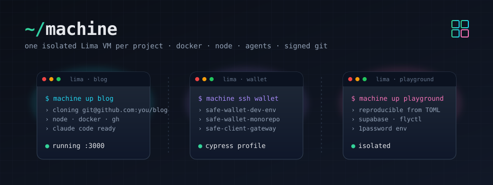

# machine — one ready-to-work dev VM per project

[](https://github.com/katspaugh/machine/actions/workflows/ci.yml)
[](https://github.com/katspaugh/machine/actions/workflows/smoke.yml)

[runmachine.dev](https://runmachine.dev/)



Isolated VMs are table stakes — an empty sandbox still costs you an afternoon before an agent can do anything in it. `machine` boots each GitHub project a Lima VM that's ready to work: Docker, Node, agent CLIs (Claude Code, Codex), GitHub CLI (`gh`), signed git, and opt-in tool profiles (Cypress, Playwright, Supabase + flyctl, modern CLI tools). No host filesystem mount, no cross-project bleed, and your private keys never leave the host.

Claude Code comes pre-installed with the official marketplace and these plugins enabled: `frontend-design`, `superpowers`, `github`, `typescript-lsp`, `security-guidance`, `commit-commands`, `chrome-devtools-mcp`, `supabase`. Permission `defaultMode` is set to `auto`.

## Why

AI coding agents are most useful with full autonomy — and full autonomy on
your host means access to your keys, your other projects, and everything
`npm install` drags in. A bare sandbox fixes the safety problem and creates a
setup problem. `machine` solves both: each project gets a disposable VM that
comes up already provisioned for agent work — toolchain installed, git auth
and signing wired through the forwarded SSH agent (private keys stay on the
host; the VM can use them through the agent while you're connected, but never
read them — see [Threat model](#threat-model)), secrets rendered into tmpfs
and gone on reboot. "Yes to everything" stops risking your laptop, and there's
no morning of setup before it's a useful answer.

Read the guide: [Sandboxing Claude Code](https://runmachine.dev/sandboxing-claude-code/).

### Claude Code already has a sandbox — why a VM?

Claude Code's built-in sandbox wraps individual commands in OS-level rules on
your host (Seatbelt on macOS, bubblewrap on Linux): writes and network are
allow-listed, reads mostly aren't, and it's still your kernel, your user
account, and your real working copy. Anything a command legitimately needs
outside the rules lands you back at permission prompts — or at "run
unsandboxed". A VM moves the whole session onto a separate machine instead of
fencing commands on yours, and solves the environment problem (toolchain,
browsers, Docker) in the same move. The two compose: the built-in sandbox
keeps working inside the VM as defense-in-depth. Full comparison — including
devcontainers, Tart, and Apple's `container` — in the
[sandboxing guide](https://runmachine.dev/sandboxing-claude-code/#comparison).

## Install

`machine` runs on **macOS 13 (Ventura) or newer — Apple Silicon or Intel**.
The VMs boot through Lima's `vz` driver (Apple's Virtualization framework), so
macOS is the only supported host; Linux and Windows hosts won't work. Guests
are Ubuntu 24.04, arm64 or amd64 to match your CPU.

```sh
brew install katspaugh/machine/machine
```

The formula pulls in `lima` (**2.0 or newer is required** — template composition and `mode: data` provisioning don't exist in 1.x) and `python@3.12`. The tap repo is [katspaugh/homebrew-machine](https://github.com/katspaugh/homebrew-machine); each release is pinned to a tagged tarball + SHA256. See [docs/TAP.md](docs/TAP.md) for the release runbook.

Prefer to run from a clone (dev mode)? Skip the brew install and:

```sh
git clone git@github.com:katspaugh/machine.git ~/Sites/machine
~/Sites/machine/bin/machine doctor
```

In dev mode `projects.toml` lives at the repo root; under brew it lives at `~/.config/machine/projects.toml` (override with `MACHINE_CONFIG_DIR`).

### Nix

The repo is also a flake — no Homebrew needed:

```sh
nix profile install github:katspaugh/machine   # install
nix run github:katspaugh/machine -- doctor     # or run one-off
```

The flake pins its own Lima (≥ 2.0) and Python from nixpkgs-unstable. Pin a release with `github:katspaugh/machine/v0.2.0`.

## Prerequisites

- A Mac on macOS 13 or newer (Apple Silicon or Intel) — see [Install](#install).
- An SSH key on the host, served by an agent the VM can forward. Either:
  - **macOS Keychain** (default): `ssh-add --apple-use-keychain ~/.ssh/id_ed25519`
  - **1Password**: enable 1Password → Settings → Developer → *Use the SSH agent* — `machine` detects the agent socket and forwards it automatically (see [SSH agent](#ssh-agent) below).
- That key registered as a **signing key** on GitHub (Settings → SSH and GPG keys → New SSH key → Key type: Signing).
- Host `git config --global user.name` and `user.email` set (or override via `GIT_NAME` / `GIT_EMAIL`).

Run `machine doctor` to verify everything resolves.

## Setup

No setup needed for a scratch VM — `machine up` launches a base VM named
`default` out of the box (and `machine up <name>` offers to create an empty
VM under any name). Add a config when you want repos cloned or profiles:

```sh
machine init                  # writes ~/.config/machine/projects.toml from the bundled example
$EDITOR ~/.config/machine/projects.toml
```

(In dev mode: `cp projects.toml.example projects.toml && $EDITOR projects.toml` from the repo root.)

Example `projects.toml`:

```toml
# Projects without `profiles` get the base VM only. To opt every project
# into a profile by default: default_profile = "cypress"

[blog]
repos = ["git@github.com:you/blog.git"]

# Multi-repo: sibling-clones in one VM. The first is the "primary" —
# `machine ssh wallet` opens at its directory.
[wallet]
profiles = ["cypress"]
repos = [
  "git@github.com:you/safe-wallet-dev-env.git",
  "git@github.com:you/safe-wallet-monorepo.git",
  "git@github.com:you/safe-client-gateway.git",
]

# Multiple profiles stack.
[playground]
profiles = ["cypress", "supabase-fly"]
repos = ["git@github.com:you/playground.git"]
```

## How it works

`machine up <project>` generates a tiny Lima template in `.build/<project>/lima.yaml`:

```yaml
base:
- <repo>/templates/cypress.yaml     # one entry per profile (reversed)
- <repo>/templates/base.yaml        # the whole base VM, declaratively — listed
                                    # last so its provisioning runs first
```

Lima merges the stack (`base:` composition), boots the VM, and runs the
provisioning declared in the templates: `provision/*.sh` scripts and
`mode: data` dotfiles, applied by cloud-init on **every boot** — so
re-provisioning is just `machine down && machine up`. Your git identity and
signing key flow in as Lima params (`--set`) at create time and render into
`~/.gitconfig` inside the VM. Ports: Lima auto-forwards any listening guest
port to `127.0.0.1` on the host.

To update the toolchain in place: `machine down <p> && machine up <p>`
(provision scripts re-run; apt picks up new versions). To start truly fresh:
`machine destroy <p> && machine up <p>`. Changing your git identity, signing
key, or `forward_agent` requires a recreate (they're fixed when the VM is
created).

### SSH config

Lima writes a per-VM SSH config at `~/.lima/<project>/ssh.config`. Add one line to `~/.ssh/config`:

```
Include ~/.lima/*/ssh.config
```

Then `ssh lima-<project>` works everywhere.

## Quickstart

```sh
machine up                 # zero-config: creates + starts a base VM named "default"
machine up blog            # creates + starts + provisions VM "blog", clones the repo
machine ssh blog           # interactive shell, cwd = ~/code/blog
```


The first `up` bakes a provisioned base disk into `~/.cache/machine` (one-time per
template/provision change); subsequent boots reuse it. `limactl start` blocks
until provisioning finishes — on failure it points you at
`limactl shell <vm> sudo tail -100 /var/log/cloud-init-output.log`.

Inside the VM, each repo is at `~/code/<repo-basename>/`. JS deps are installed automatically on first clone (yarn / pnpm / npm, picked from `packageManager` in `package.json`). For env vars, drop a `.env` file in the project — Node's `dotenv` (or your framework) reads it directly. For secrets you'd rather not write to disk, see [1Password env injection](#1password-env-injection).

Host browser → VM web app: Lima auto-forwards any listening guest port to `127.0.0.1` on the host.

## IDE integration (VS Code, Cursor, JetBrains Gateway)

With the `Include` line from [SSH config](#ssh-config) in place, any IDE that reads
SSH config sees every VM. The host alias for a project is `lima-<project>`. In VS
Code → Remote-SSH: open the host picker, pick `lima-<project>`, then open
`/home/<vm-user>.linux/code/<repo>`. Same
flow in Cursor and JetBrains Gateway. Lima's config sets `ForwardAgent yes` (unless the
project opts out with `forward_agent = false`), so commit signing and `gh` work in the
IDE's integrated terminal just like in `machine ssh`.

Because Lima owns the config file, it stays correct across `up`/`down`/`destroy`
automatically — there is no host `~/.ssh/config` block for `machine` to manage.

Prefer a terminal editor? Skip the Remote-SSH plugin entirely and run one inside the
machine: `machine run wallet hx` launches [Helix](https://helix-editor.com/) (likewise
`vim`, `nvim`, `nano`) over your existing connection, opening in the project's repo
(`~/code/<repo>`) so you can view and edit any file without anything editor-shaped on the
host.

## Commands

| Command | What |
|---|---|
| `machine up [p]` | Create if needed, start, provision, clone the repo(s). Idempotent — re-running re-applies the provision scripts. No name → base VM `default`; unknown names offer an ad-hoc base VM. |
| `machine down <p>` | Stop the VM (preserves disk). Re-provision in place with `machine up <p>` afterwards. |
| `machine ssh <p>` | Interactive shell (cwd = `~/code/<primary-repo>`). |
| `machine claude <p>` | Launch `claude` in a tmux session in the VM (cwd = `~/code/<primary-repo>`). Detach with `ctrl-b d` — claude keeps running; re-run to reattach. Exiting `claude` ends the session. |
| `machine run <p> <cmd>...` | Run a command in the VM (cwd = `~/code/<primary-repo>`). stdio is passed straight through, so full-screen TUIs work too — e.g. `machine run wallet hx` launches the [Helix](https://helix-editor.com/) editor inside the machine, in the project's repo, to view and edit any file. |
| `machine list` | List VMs (`limactl list`) plus configured-but-not-yet-created projects. |
| `machine destroy <p>` | Delete the VM. `-y` skips confirmation. |
| `machine bake` | Build/refresh the cached base disk in `~/.cache/machine` used by `up`. `--force` rebuilds even if the cache hash is fresh. |
| `machine secrets <p> [--repo <r>]` | Render 1Password Environment(s) into VM tmpfs ([1Password env injection](#1password-env-injection)). `--clear` wipes them. |
| `machine init` | Write `projects.toml` to `~/.config/machine/` from the bundled example. |
| `machine doctor` | Preflight host checks: lima, SSH agent keys, git identity, signing-key resolution, `op` CLI note, `projects.toml` presence. |

## Repository layout

```
machine/
├── bin/machine             # host CLI: renders the Lima stack, drives limactl
├── templates/              # Lima templates composed via `base:`
│   ├── base.yaml           #   the whole base VM (resources, params, dotfiles, base.sh)
│   ├── cypress.yaml        #   one file per profile — points at provision/<name>.sh
│   ├── supabase-fly.yaml
│   ├── files -> ../files   #   symlinks (Lima v2 forbids '../' in file: locators)
│   └── provision -> ../provision
├── provision/              # provision scripts run by cloud-init inside the VM
│   ├── base.sh             #   apt repos + packages, Docker, Node, Claude, npm globals
│   ├── base-user.sh        #   per-user setup (shell, claude plugins)
│   ├── cypress.sh          #   profile scripts, one per templates/<name>.yaml
│   └── supabase-fly.sh
├── files/                  # data placed into each VM via `mode: data`
│   ├── zsh/                #   ~/.zshrc
│   ├── profile.d/          #   /etc/profile.d snippets (PATH, direnv)
│   ├── direnv/             #   `use op_env` helper for 1Password env injection
│   └── ssh/                #   pre-seeded known_hosts
├── projects.toml.example   # template for your projects.toml (the real one is gitignored)
├── completions/            # bash/zsh/fish completions for the `machine` CLI
├── tests/                  # tests/lint.sh, tests/unit.sh (host); tests/smoke-*.sh (in-VM)
├── assets/                 # README gif/banner + VHS recording script (not deployed)
└── .github/workflows/      # CI: lint + unit
```


Everything under `files/` is data placed into the VM (`mode: data` entries in `templates/base.yaml`). `provision/*.sh` are the scripts cloud-init runs inside the VM on every boot. `bin/machine`, the `templates/`, `projects.toml.example`, `completions/`, and `tests/` are host-side code/config. `assets/` contains README media only; nothing under `assets/` is pushed to a VM.

What happens on `machine up <p>`:

- If no fresh base disk is cached, `machine` bakes one into `~/.cache/machine` (a provisioned base VM exported once per template/provision change).
- Render `.build/<p>/lima.yaml`: a `base:` stack of the project's `templates/<profile>.yaml` (reversed) plus `templates/base.yaml` last, with the cached base disk prepended as the top-priority image.
- If the VM doesn't exist, `limactl create --name=<p> --set '.param.gitName=…' …` against that template (git identity + signing key arrive as params), then `limactl start <p>` — which blocks until the provisioning probe passes.
- cloud-init applies the `mode: data` dotfiles and runs `provision/base.sh` then the profile scripts, on every boot, idempotently.
- Clone the listed `repos` into `~/code/<basename>/`.

GitHub auth and commit signing both use the forwarded SSH agent. Private keys never leave the host — but forwarding cuts both ways: while a session is open, anything inside the VM can ask the agent to sign and authenticate with **every** key it holds, not just for this project's repos. See [Threat model](#threat-model) for what that grants and [Restricting the forwarded agent](#restricting-the-forwarded-agent) for stricter setups.

## Provisioning

A profile is a small `templates/<name>.yaml` + `provision/<name>.sh` pair. The template
lists the script as a `provision:` entry; the generated per-project stack composes the
base plus each profile via Lima's `base:` mechanism. Provisioning is just shell — there
is no separate config format to learn.

- **base** (`templates/base.yaml` + `provision/base.sh`, `base-user.sh`) — always applied.
  Third-party apt repos (Docker, GitHub CLI, NodeSource for Node), apt packages, Docker,
  Node + corepack package managers, Claude Code + its marketplace/plugins, npm globals,
  the dotfiles under `files/`, and git identity/signing rendered from params.
- **`cypress`** — Cypress runtime libs + Chrome (amd64) or Chromium (arm64), Xvfb.
- **`playwright`** — OS deps for Playwright's browsers (via `playwright install-deps`);
  browser binaries stay per-repo (`npx playwright install`, no sudo needed).
- **`supabase-fly`** — Supabase CLI (GitHub `.deb` release) + flyctl (vendor installer).

To add a profile: copy an existing `templates/<name>.yaml`, point it at a new
`provision/<name>.sh`, and reference the profile name in `projects.toml`. Scripts run as
root by default (`mode: system`); use `mode: user` for per-user steps. Keep them
idempotent — they re-run on every boot.

## Verifying

```sh
bash tests/run-all.sh <project>     # full VM smokes (boot + docker + node + git-sign + …)
bash tests/unit.sh                  # host-side Python unit tests (no VM)
machine doctor                      # preflight host environment
```

`tests/run-all.sh` requires a provisioned VM (set `MACHINE_NAME=<project>` or pass the project as arg 1). `tests/unit.sh` runs offline.

## Shell completion

Bash, zsh, and fish completions ship under `completions/`:

```sh
# bash
echo 'source /path/to/machine/completions/machine.bash' >> ~/.bashrc

# zsh (somewhere in $fpath)
ln -s "$PWD/completions/_machine" /usr/local/share/zsh/site-functions/_machine

# fish
ln -s "$PWD/completions/machine.fish" ~/.config/fish/completions/machine.fish
```

## SSH agent

`machine` picks the agent to forward automatically: if 1Password's SSH agent socket exists (Settings → Developer → *Use the SSH agent*), it forwards that — keys never touch `~/.ssh`, every signature prompts for Touch ID. Otherwise it forwards whatever the host's `SSH_AUTH_SOCK` points at — on macOS that's launchd's agent, which serves keys you loaded with `ssh-add --apple-use-keychain` (passphrase cached in Keychain).

To force the Keychain agent while 1Password's agent is enabled, point `ONEPASS_SOCK` at a non-socket path (e.g. `ONEPASS_SOCK=/dev/null machine up <project>`).

For the git signing pubkey, the resolution order is:

1. `GIT_SIGNING_KEY=<literal pubkey string>`
2. `OP_SIGNING_KEY_REF=op://Vault/Item/public_key` — fetched via `op read` (requires `op` CLI; triggers Touch ID once at `up` time)
3. `GIT_SIGNING_PUBKEY_FILE=<path>`
4. Host `git config --global user.signingkey` — literal pubkey or path to a `.pub` file (default; whatever you sign host commits with)

### Restricting the forwarded agent

Forwarding is the convenience default, and it is a real grant: an SSH agent
performs arbitrary auth operations, so while a forwarded connection is open,
anything inside the VM — a compromised dependency, a prompt-injected agent —
can authenticate and sign as you with **every** key the agent holds. `git push`
to any repo your key can access is in scope, not just this project's. (Lima
keeps a persistent SSH master alive from your first shell until the VM stops,
so treat the channel as open whenever the VM is running and you've connected.)
Pick the friction that matches the trust level of the project:

- **Per-use approval (1Password agent).** 1Password can require approval /
  Touch ID for each agent request and lets you choose how long an approval
  lasts (Settings → Developer → Security). Keep the authorization window short
  for untrusted work, and an injected `git push` becomes a prompt you get to
  decline.
- **Confirmation-gated key (Keychain agent).** Load the key with
  `ssh-add -c ~/.ssh/id_ed25519` — the agent then asks for confirmation on
  every use. macOS needs an askpass helper to show the dialog
  (`brew install theseal/ssh-askpass/ssh-askpass`).
- **No forwarding + a per-project deploy key (strictest).** Set
  `forward_agent = false` for the project in `projects.toml` — the generated
  template overrides `ssh.forwardAgent`, and the VM gets no channel to your
  agent at all. Generate a key inside the VM (`ssh-keygen -t ed25519`) and add
  its pubkey to the repo as a [deploy key](https://docs.github.com/en/authentication/connecting-to-github-with-ssh/managing-deploy-keys)
  (write access only if it should push): a compromised VM can then reach only
  that repo. With repos listed, the first `machine up` warns that the clone
  needs the deploy key instead of failing. Commit signing can't use your host
  key either — either register the VM key as a signing key on GitHub and
  `git config --global user.signingkey ~/.ssh/id_ed25519.pub` inside the VM,
  or `git config --global commit.gpgsign false` there. Like the git params,
  changing `forward_agent` takes effect on recreate
  (`machine destroy <p> && machine up <p>`).

## 1Password env injection

For project secrets you don't want to write to disk, drop a `.envrc` in the repo referencing a 1Password [Environment](https://developer.1password.com/docs/cli/environments/) ID:

```sh
echo 'use op_env <environment-id>' > .envrc
direnv allow
```

Then on the host:

```sh
machine secrets <project>               # syncs every .envrc using `use op_env` in that VM
machine secrets <project> --repo <repo> # narrow to one repo within a multi-repo project
```

`machine secrets` reads the Environment from 1Password (Touch ID), pipes the rendered KEY=value pairs into the VM, and writes them to `$XDG_RUNTIME_DIR/dev-secrets/<env-id>.env` (tmpfs, mode 600, gone on reboot). The `op_env` direnv helper loads that cache when you `cd` into the project. No host-side disk path is involved.

Create an Environment in 1Password desktop: Developer → Environments → New. Copy its ID via Manage environment → Copy ID.

## Threat model

No host filesystem is mounted. Each project gets its own VM, so a compromise of one project can't reach another's code or env. The host exposes two narrow channels:

- The **forwarded SSH agent**. Private keys never leave the host and the VM cannot read them — but it can *use* them: while a forwarded connection is open, anything inside the VM can ask the agent to sign commits and to authenticate as you with every key the agent holds. That means a compromised or prompt-injected agent in one VM could `git push` to **any repo your key authorizes**, not just this project's. The isolation here is read-protection of the key material and a channel that dies with the VM — not a per-project scope. To narrow the grant, use per-use approval (1Password), a confirmation-gated key (`ssh-add -c`), or drop forwarding entirely in favor of a per-project deploy key — see [Restricting the forwarded agent](#restricting-the-forwarded-agent).
- **`machine secrets`** pushing rendered 1Password Environments into tmpfs (no disk persistence). A fully compromised VM cannot read the 1Password vault — only the secrets a repo explicitly rendered, and only while that tmpfs lives.

## Override knobs

| Env var | Default |
|---|---|
| `GIT_NAME` / `GIT_EMAIL` | from host `git config --global` |
| `GIT_SIGNING_PUBKEY_FILE` | path to a `.pub` file (overrides host `user.signingkey`) |
| `GIT_SIGNING_KEY` | literal pubkey string (overrides everything) |
| `OP_SIGNING_KEY_REF` | 1Password secret reference for the signing pubkey (e.g. `op://Personal/SSH/public key`) |
| `ONEPASS_SOCK` | 1Password agent socket path (default `~/Library/Group Containers/2BUA8C4S2C.com.1password/t/agent.sock`); auto-forwarded when it exists |
| `PROJECTS_FILE` | `<repo>/projects.toml` in dev mode; `~/.config/machine/projects.toml` under Homebrew |
| `MACHINE_CONFIG_DIR` | config-directory location (`~/.config/machine` by default) |
| `MACHINE_STATE_DIR` | generated-state location (`<repo>/.build` in dev mode; `~/.local/state/machine` under Homebrew) |

## Troubleshooting

Run `machine doctor` first — it catches most of these before a VM is involved.

**`machine up` fails before the VM boots with a template error** (`unknown
field`, `failed to unmarshal`, or similar). You're on Lima 1.x — `machine`
needs Lima ≥ 2.0 (`base:` template composition and `mode: data` provisioning
don't exist in 1.x). Check `limactl --version`, then `brew upgrade lima`.

**`git clone` / `git push` inside the VM fails with `Permission denied
(publickey)`.** The forwarded agent has no usable keys. On the host, `ssh-add
-l` must list at least one key: for the Keychain agent run `ssh-add
--apple-use-keychain ~/.ssh/id_ed25519`; for 1Password, unlock the app (a
locked 1Password agent serves nothing). If the agent was empty or locked when
the VM connection was first opened, just re-run `machine ssh` — it detects the
stale connection and rebuilds it against the live agent.

**Pushes work but commits show "Unverified" on GitHub.** GitHub registers SSH
keys for *authentication* and *signing* separately. Add the same public key a
second time at Settings → SSH and GPG keys → New SSH key, with Key type:
**Signing**. (The reverse confusion — key added only as Signing — makes
signing work and `git clone` fail.)

**`git commit` fails with `agent refused operation`.** The agent declined to
sign — with 1Password that means the app is locked or you dismissed the Touch
ID prompt. Unlock 1Password and expect one Touch ID prompt per signature.

**Provisioning fails or `machine up` times out.** Read the cloud-init log:
`limactl shell <vm> sudo tail -100 /var/log/cloud-init-output.log`. Then
re-run `machine up <p>` — provisioning is idempotent, and transient apt or
network failures usually clear on the second pass.

**The VM hangs at boot after your host disk filled up.** A full host disk can
leave the guest's ext4 filesystem flagged with errors, and the VM never comes
up. Free host space first; then `machine destroy <p> && machine up <p>` — the
cached base disk makes the rebuild fast. If you need data out of the old VM,
its disk image (under `~/.lima/<p>/`) can be repaired offline with `e2fsck`
before you destroy it.

**Changed `GIT_NAME` / `GIT_EMAIL` / signing key, but the VM still uses the
old one.** Identity flows in as Lima params, fixed when the VM is created.
`machine destroy <p> && machine up <p>` to re-create with the new values.

**`machine secrets` fails to read an Environment.** It needs the `op` CLI
(`brew install 1password-cli`) and the desktop-app integration enabled:
1Password → Settings → Developer → *Integrate with 1Password CLI*.

**1Password's agent is enabled but you want the Keychain agent.** Point
`ONEPASS_SOCK` at a non-socket path: `ONEPASS_SOCK=/dev/null machine up <p>`.

## Contributing

See [CONTRIBUTING.md](CONTRIBUTING.md) — the profile-authoring walkthrough
lives there. Bug reports should include `machine doctor` output.
